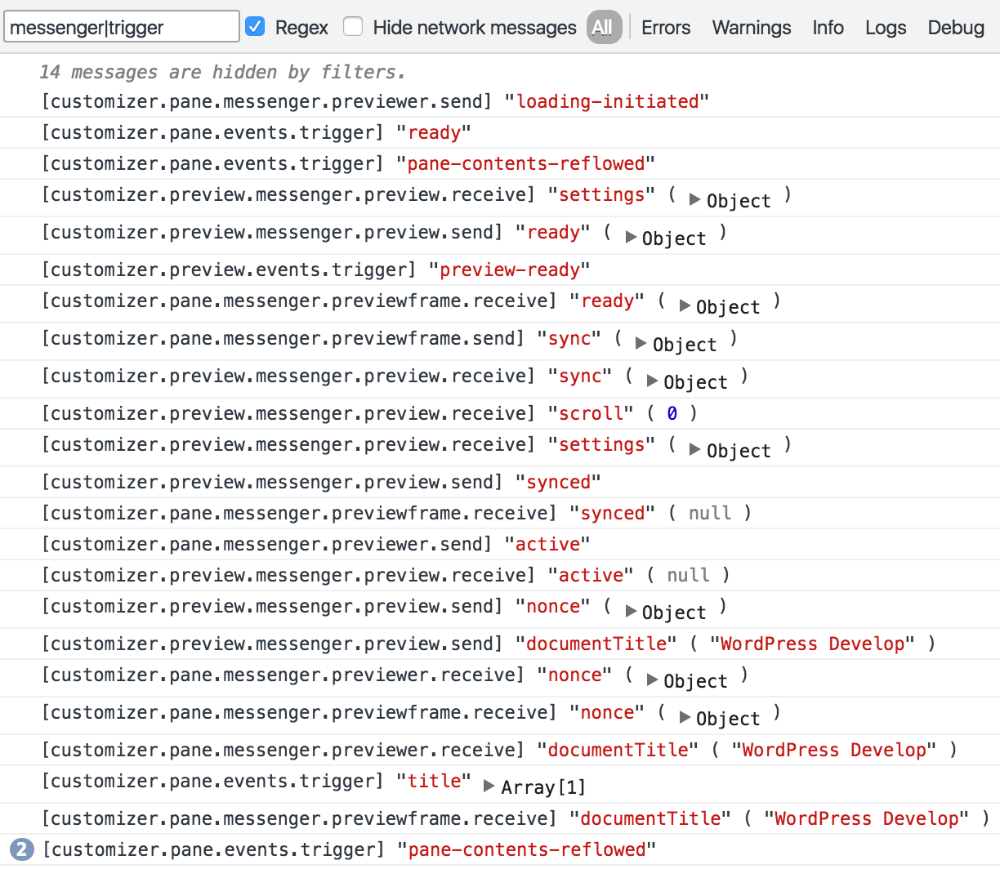
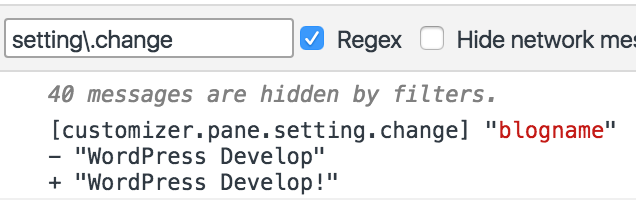
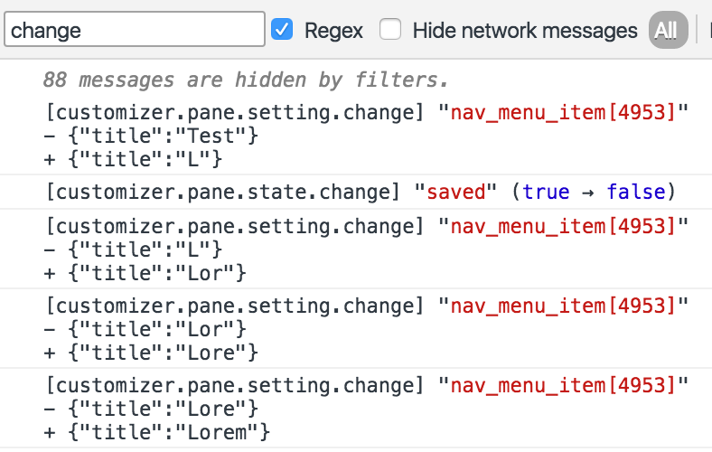
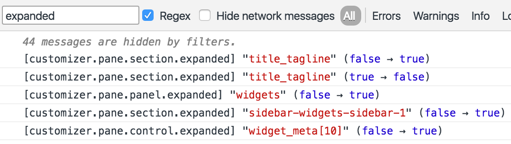
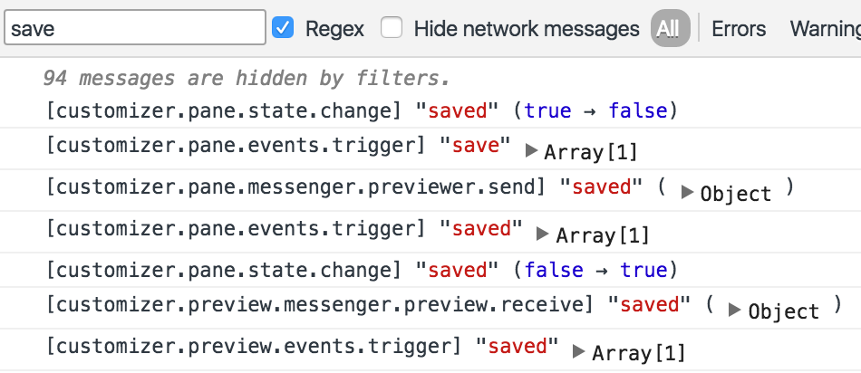

<!-- DO NOT EDIT THIS FILE; it is auto-generated from readme.txt -->
# Customizer Dev Tools

Tools for facilitating JavaScript development in the customizer.

**Contributors:** [xwp](https://profiles.wordpress.org/xwp), [westonruter](https://profiles.wordpress.org/westonruter)  
**Tags:** [customizer](https://wordpress.org/plugins/tags/customizer), [customize](https://wordpress.org/plugins/tags/customize), [dev-tools](https://wordpress.org/plugins/tags/dev-tools), [debug](https://wordpress.org/plugins/tags/debug), [debugging](https://wordpress.org/plugins/tags/debugging), [developer](https://wordpress.org/plugins/tags/developer), [development](https://wordpress.org/plugins/tags/development)  
**Requires at least:** 4.5  
**Tested up to:** 4.6  
**Stable tag:** 0.7.0  
**License:** [GPLv2 or later](http://www.gnu.org/licenses/gpl-2.0.html)  

[](https://travis-ci.org/xwp/wp-customizer-dev-tools) 

## Description ##

The customizer is a single-page application that includes a lot of events, messages, and state changes which drive the application. Being aware of these things is essential for developing JavaScript for the customizer.

To use, activate the plugin, open the customizer and the browser console and enter:

```js
CustomizerDevTools.startLogging()
```

You can then either start interacting with the customizer app to see the log entries from that point, or you can reload the customizer to see the log entries emitted during the customizer initialization.

Not everything in the customizer is currently implemented to emit a log entry. File an issue for any specific event that may be needed.

Features:

* Start logging of customizer events via running `CustomizerDevTools.startLogging()` from your browser console, and stop via `CustomizerDevTools.stopLogging()`. In the former, you can filter what is logged out by passing a string or regular expression (`RegExp` object) to match against the given log, or you can use the browser console's built-in log filtering.
* Logs out all events triggered on `wp.customize`.
* Logs out additions and changes to to `wp.customize.state`.
* Logs changes to the `active` and `expanded` states for panels, sections, and controls.
* Logs out messages sent and received by the pane (controls) and preview.
* Logs out dynamic addition and removal of panels, sections, controls, partials, and settings (after the `ready` event triggers).
* The `wp.customize` object from the Customizer preview is made persistently available from the parent frame via `CustomizerDevTools.previewCustomize`. This reference is updated whenever the preview refreshes, so you no longer have to change the frame window context to access this object.
* In the same way, the current Customizer preview `window` is exposed as `CustomizerDevTools.previewWindow`.  This is a shortcut for doing `wp.customize.previewer.targetWindow.get()`, and it has the added benefit of allowing the browser's dev tools to provide auto-completion.

Make sure you also install the [Customizer Browser History](https://github.com/xwp/wp-customizer-browser-history) and [Customize Snapshots](https://github.com/xwp/wp-customize-snapshots) plugins so that you can reload the browser window and have the Customizer load with the same state as before you reloaded, including the persistence of the focused panel, section, control, the previewed URL, the scroll position in the preview, and which device is being previewed.

## Screenshots ##

### Messages sent/received and events triggered during Customizer load.



### Logging the changing of the Site Title.



### Logging the change of a nav menu item from a saved sate.



### Expanding the Site Identity section and then navigating to edit a widget.



### Changes to `wp.customize.state` when saving the customizer changes.


### State changes, messages, and events related to saving.



